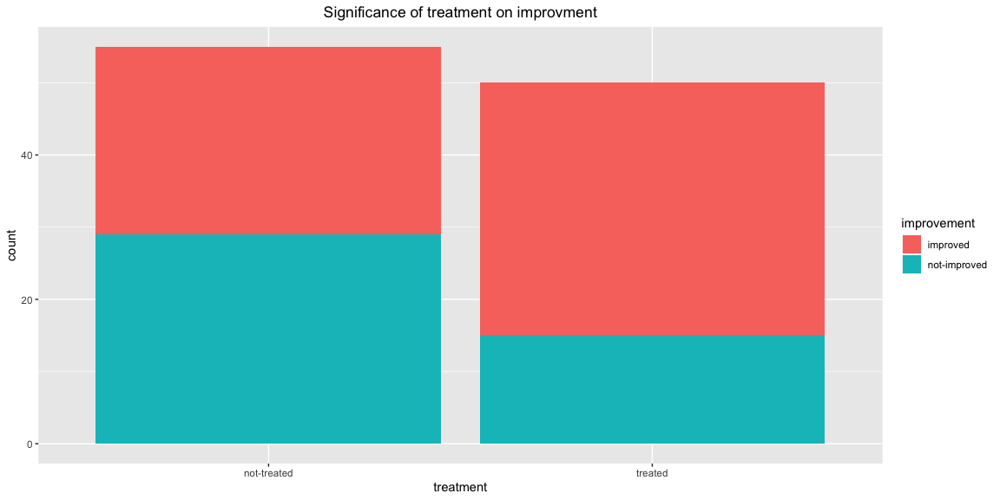

```r
# Use this R-Chunk to import all your datasets!

data_medicine <- read.csv("https://goo.gl/j6lRXD")
```

## Background

Here I will do a chi square test in order to prove the effectivness or ineffectivness of a drug on an unkown condition. The chi-square model mathematically shown is here:
$$
  \chi^2 = \sum_{i=1}^m \frac{(O_i - E_i)^2}{E_i}
$$

## Question and Hypothesis

Question: Does the treatment make the individual's condition better?

$H_0$: Treatment and the improvment of the individual are independent.

$H_a$: Treatment and the improvment of the individual are associated (not independent).

## Analysis


```r
# make a table
treatment_data <- table(data_medicine$treatment, data_medicine$improvement)
pander(treatment_data)
```


-------------------------------------------
     &nbsp;        improved   not-improved 
----------------- ---------- --------------
 **not-treated**      26           29      

   **treated**        35           15      
-------------------------------------------

```r
results <- chisq.test(treatment_data)
pander(results)
```


---------------------------------
 Test statistic   df    P value  
---------------- ---- -----------
     4.663        1    0.03083 * 
---------------------------------

Table: Pearson's Chi-squared test with Yates' continuity correction: `treatment_data`

We will use a significance level of $a=0.05$. It looks like there is a correlation between the treatment and individuals improving. 


## Data Visualization


```r
# Use this R-Chunk to plot & visualize your data!
ggplot(data = data_medicine, mapping = aes(x = treatment, fill = improvement)) +
  geom_bar() +
  labs(title = "Significance of treatment on improvment") +
  theme(plot.title = element_text(hjust = 0.5))
```

<!-- -->

Here we can see that the ratio of people that improve due to the treatment is higher than people don't recieve treatment.


## Interpretation

Here we used a chi-quare test to see if there was a correlation between treatment and recovery. It turns out there was and we can then visualize that with our bar chart. Our question has been answered. We know that the medication does have a positive effect on the patients. 


